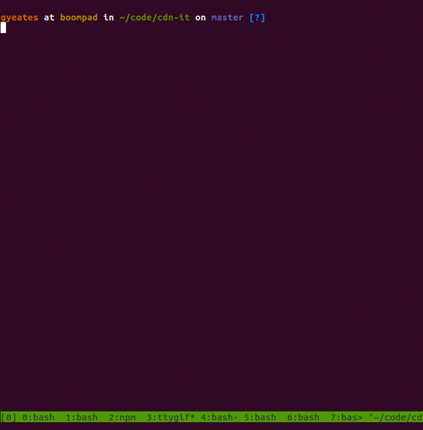

CDN-it
============

Quickly publish an autoupdating project to jsDelivr by entering a config (`package.json`, `bower.json`, etc) and filling in some prompts


# Install

```sh
$ pip install cdn-it
```

# Usage

```sh
$ cdn-it <url|file> --token <github token>
```




Example pull request: https://github.com/jsdelivr/jsdelivr/pull/6024